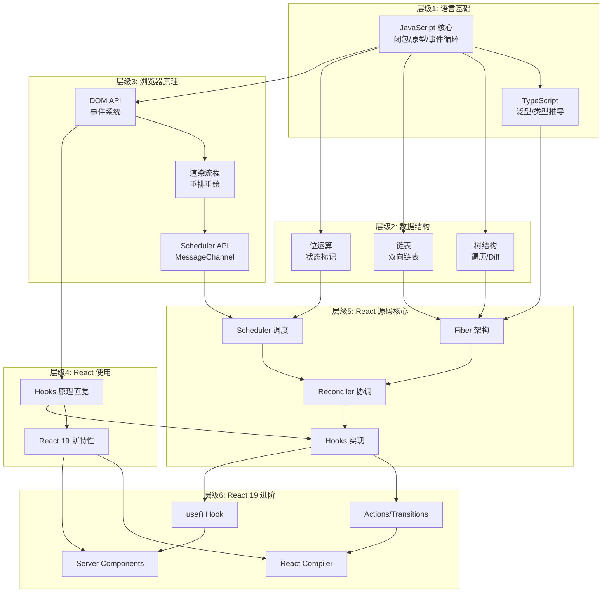

# React 19 源码学习路线

## 1. 前置知识清单（地基检查）

### 层级一：语言基础
- **JavaScript 核心**：闭包、原型链、事件循环、Promise/async-await
- **TypeScript**：类型系统、泛型、类型推导

### 层级二：数据结构与算法
- **树结构**：遍历、Diff算法
- **链表**：单向/双向链表操作
- **栈/队列**：任务调度相关
- **位运算**：状态标记、优先级计算

### 层级三：浏览器原理
- **DOM API**：节点操作、事件系统
- **渲染流程**：重排重绘、合成层
- **Scheduler API**：requestIdleCallback、MessageChannel

### 层级四：React 使用经验
- **核心API**：Hooks、Context、Suspense
- **React 19新特性**：Actions、use()、Server Components

---

## 2. 学习路径依赖图



---

## 3. 每个大类的 20% 核心知识（80%效果）

### 3.1 JavaScript 核心 (20%核心)

| 核心点 | 原因 |
|--------|------|
| **闭包** | Hooks状态保存的基础 |
| **事件循环 + 微任务** | 理解批量更新、调度时机 |
| **Object.is** | 状态比较策略 |

#### 原子化问题：
```
Q1: 写一个函数，每次调用返回递增的数字（不用全局变量）
Q2: 解释为什么 setTimeout(() => console.log(1), 0) 比 Promise.resolve().then(() => console.log(2)) 后执行
Q3: Object.is(NaN, NaN) 返回什么？Object.is(0, -0) 呢？为什么React选择它做比较？
```

#### 可跳过的枝节：
- Proxy/Reflect 完整API（React未大量使用）
- Generator 深入细节（Fiber用但已封装）
- 复杂的原型继承模式

---

### 3.2 数据结构 (20%核心)

| 核心点 | 原因 |
|--------|------|
| **树的DFS遍历** | Fiber树遍历核心 |
| **双向链表操作** | Update队列、Effect链表 |
| **位运算 AND/OR** | Lane优先级标记 |

#### 原子化问题：
```
Q1: 手写树的先序遍历（递归+非递归）
Q2: 实现双向链表的insertAfter和remove操作
Q3: 用位运算判断数字n是否包含标记位mask：(n & mask) !== 0 解释原理
Q4: 如何用位或运算合并多个优先级？
```

#### 可跳过的枝节：
- 红黑树、AVL树
- 图算法
- 复杂排序算法

---

### 3.3 浏览器原理 (20%核心)

| 核心点 | 原因 |
|--------|------|
| **MessageChannel** | Scheduler实际使用的调度方式 |
| **requestAnimationFrame** | 渲染时机理解 |
| **事件委托** | React合成事件原理 |

#### 原子化问题：
```
Q1: 为什么React Scheduler用MessageChannel而不是setTimeout(0)？
Q2: rAF回调在事件循环的什么阶段执行？
Q3: 实现一个简单的事件委托：在父元素上监听所有子button的点击
```

#### 可跳过的枝节：
- Service Worker细节
- WebWorker通信细节
- CSS动画性能优化

---

### 3.4 Fiber 架构 (20%核心)

| 核心点 | 原因 |
|--------|------|
| **Fiber节点结构** | 理解 child/sibling/return 三指针 |
| **双缓冲机制** | current/workInProgress树切换 |
| **工作循环** | workLoopSync/workLoopConcurrent |

#### 原子化问题：
```
Q1: 画出以下JSX对应的Fiber树结构（标注child/sibling/return）：
    <div><span/><p/></div>
Q2: 什么是alternate？为什么需要两棵树？
Q3: beginWork和completeWork分别做什么？遍历顺序是什么？
Q4: 什么情况下workLoop可以被中断？
```

#### 可跳过的枝节：
- Profiler相关的DevTools集成
- Legacy模式的特殊处理
- Offscreen组件细节

---

### 3.5 Scheduler 调度器 (20%核心)

| 核心点 | 原因 |
|--------|------|
| **优先级定义** | ImmediatePriority到IdlePriority的5级 |
| **时间切片** | shouldYield判断逻辑 |
| **最小堆任务队列** | taskQueue排序机制 |

#### 原子化问题：
```
Q1: 列出Scheduler的5个优先级，各自的过期时间是多少？
Q2: shouldYield()的判断依据是什么？默认切片时间多长？
Q3: 为什么任务队列用最小堆而不是普通数组？
```

#### 可跳过的枝节：
- isInputPending的polyfill细节
- 各种超时fallback策略
- Node.js环境适配

---

### 3.6 Reconciler 协调 (20%核心)

| 核心点 | 原因 |
|--------|------|
| **Lane模型** | React 19的优先级系统 |
| **Diff算法核心** | 单节点/多节点diff策略 |
| **Effect标记** | Placement/Update/Deletion |

#### 原子化问题：
```
Q1: 什么是Lane？与旧的expirationTime有什么区别？
Q2: 多节点diff中，为什么需要两轮遍历？第一轮处理什么，第二轮处理什么？
Q3: React如何处理key的变化？如果key从a-b-c变成c-a-b会发生什么？
Q4: Placement和Update的flags值分别是多少（二进制）？
```

#### 可跳过的枝节：
- SuspenseList实现细节
- Hydration的完整边界处理
- SelectiveHydration的所有case

---

### 3.7 Hooks 实现 (20%核心)

| 核心点 | 原因 |
|--------|------|
| **Hooks链表** | fiber.memoizedState结构 |
| **useState/useReducer** | 最常用Hook的更新队列 |
| **useEffect执行时机** | commit阶段的调度 |

#### 原子化问题：
```
Q1: 多个useState调用如何存储？画出fiber.memoizedState的链表结构
Q2: 为什么Hooks不能放在条件语句中？
Q3: useState('A')实际上调用的是什么？（mountState还是updateState）
Q4: useEffect和useLayoutEffect在commit阶段的执行顺序差异是什么？
```

#### 可跳过的枝节：
- useDebugValue实现
- useSyncExternalStore的完整实现
- useId的随机算法

---

### 3.8 React 19 新特性 (20%核心)

| 核心点 | 原因 |
|--------|------|
| **Actions/useTransition** | 异步状态更新的新模式 |
| **use() Hook** | Promise/Context的统一读取 |
| **自动批处理增强** | 所有更新默认批处理 |

#### 原子化问题：
```
Q1: useTransition返回的isPending和startTransition分别是什么？
Q2: use(promise)和await promise的本质区别是什么？
Q3: 在React 18中setTimeout里的setState不会批处理，React 19呢？为什么？
Q4: Action函数和普通异步函数的区别是什么？
```

#### 可跳过的枝节：
- Server Components的服务端实现（可专项学习）
- React Compiler的编译细节（可专项学习）
- Asset Loading的preload策略细节

---

## 推荐学习顺序

```mermaid
gantt
    title React 19 源码学习计划
    dateFormat X
    axisFormat %s
  
    section 基础补足
    JS事件循环    :a1, 0, 2
    数据结构      :a2, after a1, 2
  
    section 源码入门
    Fiber结构     :b1, after a2, 3
    Scheduler     :b2, after b1, 2
  
    section 核心机制
    Reconciler    :c1, after b2, 4
    Hooks实现     :c2, after c1, 3
  
    section React 19
    Actions/use   :d1, after c2, 3
    Compiler概念  :d2, after d1, 2
```



---

## 建议的源码阅读入口文件

```
packages/
├── react/                      # 入口API定义
│   └── src/ReactHooks.js       # 看Hooks的dispatcher切换
├── react-reconciler/           # ⭐核心
│   ├── src/ReactFiber.js       # Fiber节点定义
│   ├── src/ReactFiberWorkLoop.js  # 工作循环
│   ├── src/ReactFiberBeginWork.js # 递阶段
│   ├── src/ReactFiberCompleteWork.js # 归阶段
│   └── src/ReactFiberHooks.js  # Hooks实现
├── scheduler/                  # 调度器
│   └── src/forks/Scheduler.js  # 核心调度逻辑
└── react-dom/                  # DOM渲染器
    └── src/client/ReactDOMRoot.js  # createRoot入口
```